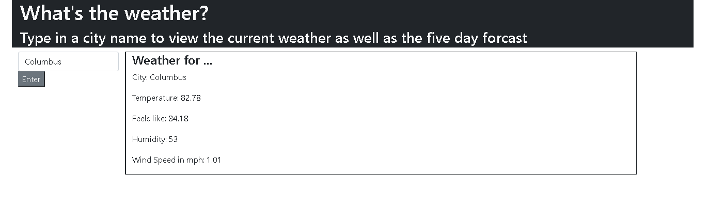

# Weather-app

## Description
Draft of a weather website that allows you to search by city to display the current weather including the temperature, feels like temperature, humidity, and wind speed. Search results are saved into local storage. Future development includes displaying a 5 day forecast of the searched city, retireving items from local storage to display on the page to eventually select those as buttons to display previously searched data, and upgrading the design of the website to display the data in a more friendly way, including pictures and icons of the current and future weather. 

## Contributing
Please contact me via github or email if you are interested in contributing to this project. 

## Questions
If you have questions, feel free to contact me on here, thank you! 